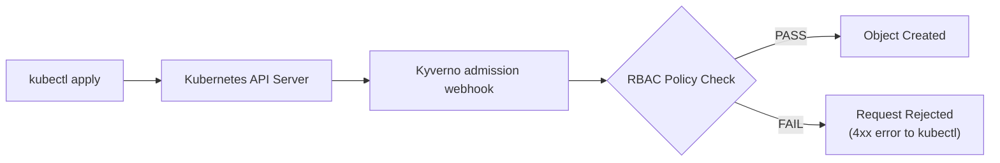

# RBAC Admission Control (Kyverno)

How the Kyverno layer works, end to end — a different point in the
pipeline from the rest of this lab, worth understanding on its own terms.

## Why this exists, and how it differs from everything else here

Every other doc in this repo is about **passive observation**: eBPF
watches things that already happened — a connection that was opened, a
process that already started, a file that was already read — after the
fact. Nothing here can stop any of that from happening; it only sees it.

Kyverno is the opposite kind of control: an **admission controller** that
sits in-line in front of the Kubernetes API server and can **reject a
request before the object is ever created**. This is the flow you asked
for, wired up as a real, testable control:



Concretely: the Kubernetes API server has a `ValidatingWebhookConfiguration`
pointing at Kyverno's admission-controller Service. Every `CREATE`/`UPDATE`
for the resource kinds Kyverno is configured to watch gets sent to it
*before* being persisted to etcd. Kyverno evaluates every matching
`ClusterPolicy` rule against the incoming object and returns allow/deny —
only on allow does the API server actually create the object. `kubectl`
sees a normal HTTP response either way: `201 Created`, or a `4xx` with the
policy's rejection message attached.

## The two policies

Both are Kyverno `ClusterPolicy` custom resources, applied cluster-wide
(not scoped to `ebpf-lab`), with `validationFailureAction: Enforce` — a
`FAIL` isn't just logged, it actually blocks the request.

### `disallow-default-serviceaccount`

[`k8s/kyverno/policies/disallow-default-serviceaccount.yaml`](../k8s/kyverno/policies/disallow-default-serviceaccount.yaml)

Rejects any Pod that doesn't name an explicit `serviceAccountName`.
Kubernetes silently attaches the `default` ServiceAccount (and, depending
on cluster config, its token) to any Pod that doesn't ask for one — an
easy-to-overlook implicit RBAC identity. The policy's core check:

```yaml
deny:
  conditions:
    any:
      - key: "{{ request.object.spec.serviceAccountName || 'default' }}"
        operator: Equals
        value: "default"
```

`match.any[].resources.kinds` lists only `Pod`, but Kyverno's **autogen**
feature automatically derives matching rules for Deployment, DaemonSet,
Job, ReplicaSet, ReplicationController, StatefulSet, and CronJob from a
Pod-level rule (visible under `.status.autogen` on the applied
ClusterPolicy) — so `kubectl apply`-ing a Deployment with a bad Pod
template gets rejected at the Deployment, not three levels down when the
ReplicaSet controller eventually tries to create the Pod.

### `restrict-rbac-wildcards`

[`k8s/kyverno/policies/restrict-rbac-wildcards.yaml`](../k8s/kyverno/policies/restrict-rbac-wildcards.yaml)

Rejects any `Role`/`ClusterRole` where any rule uses `"*"` for
`apiGroups`, `resources`, or `verbs` — the textbook RBAC over-permissioning
anti-pattern (`resources: ["*"], verbs: ["*"]` is effectively
cluster-admin). The check flattens every rule's arrays with JMESPath and
looks for a literal `"*"` anywhere in them:

```yaml
deny:
  conditions:
    any:
      - key: "{{ contains(request.object.rules[].apiGroups[], '*') }}"
        operator: Equals
        value: true
      - key: "{{ contains(request.object.rules[].resources[], '*') }}"
        operator: Equals
        value: true
      - key: "{{ contains(request.object.rules[].verbs[], '*') }}"
        operator: Equals
        value: true
```

## Why the sample-app manifests needed changes

Before Kyverno, `web-backend`, `traffic-generator`, and `ebpf-dashboard`
all implicitly ran as the `default` ServiceAccount, like most quick K8s
manifests do. Once `disallow-default-serviceaccount` went into `Enforce`
mode, their next rollout would have been rejected. Each now has its own
dedicated ServiceAccount, bound to nothing (see
[`k8s/dashboard.yaml`](../k8s/dashboard.yaml),
[`k8s/sample-app/web-backend.yaml`](../k8s/sample-app/web-backend.yaml),
[`k8s/sample-app/traffic-generator.yaml`](../k8s/sample-app/traffic-generator.yaml)) —
none of them talk to the Kubernetes API, so the point isn't to grant them
anything, it's to make each workload's (lack of) RBAC identity explicit
and auditable instead of implicit.

## Testing it yourself

Four manifests in
[`k8s/kyverno/test-manifests/`](../k8s/kyverno/test-manifests/) exercise
both PASS and FAIL for both policies. Each file's own comment states what
should happen:

```bash
cd k8s/kyverno/test-manifests

# REJECTED - no serviceAccountName means the implicit "default" SA:
kubectl apply -f fail-pod-default-sa.yaml
```

```
Error from server: error when creating "fail-pod-default-sa.yaml": admission webhook "validate.kyverno.svc-fail" denied the request:

resource Pod/default/kyverno-test-fail-default-sa was blocked due to the following policies

disallow-default-serviceaccount:
  validate-service-account: Pods may not use the "default" ServiceAccount (or omit
    spec.serviceAccountName, which implies "default"). Create a dedicated ServiceAccount
    for this workload instead.
```

```bash
# REJECTED - apiGroups/resources/verbs are all "*":
kubectl apply -f fail-clusterrole-wildcard.yaml

# CREATED - dedicated ServiceAccount, satisfies the policy:
kubectl apply -f pass-pod-custom-sa.yaml
kubectl get pod kyverno-test-pass-custom-sa
kubectl delete -f pass-pod-custom-sa.yaml   # clean up

# CREATED - explicit, scoped permissions, no wildcards:
kubectl apply -f pass-clusterrole-scoped.yaml
kubectl delete -f pass-clusterrole-scoped.yaml   # clean up
```

To confirm Kyverno itself (not just your policies) is healthy:

```bash
kubectl get pods -n kyverno
# admission/background/cleanup/reports-controller all 1/1 Running

kubectl get clusterpolicy
# ADMISSION=true, READY=True for both policies
```

## Real gotchas hit building this

Every one of these produced a failure with no obvious connection to its
actual cause — worth knowing before you write your own Kyverno policies.

### 1. An operator type-mismatch silently rejected *everything*

An early version of `restrict-rbac-wildcards` used the `AnyIn` operator
with a **scalar** key (`key: "*"`) compared against an array value —
`AnyIn` expects the key itself to be an array. Kyverno didn't surface a
type error; it just denied *every* Role submitted, including fully
compliant ones, with the same generic "validation failure" message. There
was no signal that the policy logic itself was broken versus the test
object being genuinely non-compliant — only testing a known-good object
and watching it get rejected anyway revealed it. The fix was switching to
a plain JMESPath `contains()` check (shown above) instead of an
operator-based array-membership condition.

**Lesson**: if a Kyverno `deny` rule seems to reject *everything*
regardless of content, suspect an operator/type mismatch before assuming
your object is actually wrong. Test with a deliberately compliant object
first.

### 2. Autogenerated rules also intercept `DELETE`, and fail closed

Kyverno's autogenerated rules (see above) matched `Pod`/`Deployment`/etc.
for *all* operations by default — including `DELETE`, where
`request.object` is empty (Kubernetes sends the old object under
`oldObject` on delete, not `object`). Evaluating
`request.object.spec.template.spec.serviceAccountName` against an empty
object threw a JMESPath error, and Kyverno **failed closed**: it silently
blocked garbage collection of old ReplicaSets during a rollout. Symptom
was `FailedDelete` events on ReplicaSets and pods stuck in
`Terminating`/orphaned ReplicaSets never scaling to zero — nothing about
the error mentioned Kyverno or DELETE explicitly at first glance.

**Fix**: both policies now explicitly scope
`match.any[].resources.operations` to `[CREATE, UPDATE]`.

### 3. The policy engine blocked its own bootstrap

Kyverno's own Helm chart runs a post-upgrade hook Job
(`kyverno:migrate-resources`) that needs broad, wildcard-style permissions
to manage arbitrary cluster resources — entirely legitimate for a policy
engine's own control plane. The first time `restrict-rbac-wildcards` was
applied, it blocked that hook's own `ClusterRole` from being created,
breaking Kyverno's *own* upgrade with the same error a real violation
would produce.

**Fix**: both policies `exclude` any request made by a ServiceAccount in
the `kyverno` namespace:
```yaml
exclude:
  any:
    - subjects:
        - kind: ServiceAccount
          namespace: kyverno
          name: "*"
```
(Kubernetes RBAC `Subject` objects require a `name` field — `"*"`, not an
omitted field, is what makes this a namespace-wide exclusion.)

### 4. `exclude.subjects` requires `background: false`

`exclude.any[].subjects` depends on live admission-request context (who's
making the request) — context that doesn't exist during Kyverno's
periodic background re-scan of already-existing resources (used to
retroactively generate PolicyReports). Kyverno's own policy validation
rejects `background: true` combined with a subjects-based exclude
outright — this one at least fails at `kubectl apply` time with a clear
message telling you to set `background: false`, rather than misbehaving
silently like the first three.

**Fix**: since this lab's goal is admission-time enforcement (the
`kubectl apply` path), not retroactive scanning of pre-existing resources,
both policies set `background: false`.

## Glossary

| Term | Meaning here |
|---|---|
| **Admission controller** | A component the API server calls out to *before* persisting an object, able to allow, reject, or mutate the request. |
| **ValidatingWebhookConfiguration** | The Kubernetes object registering Kyverno's webhook with the API server, declaring which resource kinds/operations it should be called for. |
| **ClusterPolicy** | Kyverno's custom resource for a cluster-wide policy (as opposed to a namespace-scoped `Policy`). |
| **Autogen** | Kyverno automatically deriving matching rules for higher-level controllers (Deployment, DaemonSet, Job, ...) from a Pod-level policy rule. |
| **`validationFailureAction`** | `Enforce` actually blocks the request; `Audit` only logs/reports a violation and lets it through. Both policies here use `Enforce`. |
| **`background`** | Whether Kyverno also periodically re-evaluates the policy against already-existing resources (for PolicyReports), independent of live admission requests. Disabled here (see gotcha #4). |
| **Subject** (RBAC) | A Kubernetes RBAC concept identifying *who* is making a request — a User, Group, or ServiceAccount. Used here in `exclude` to exempt Kyverno's own control plane. |

## See also

- [DEPLOYMENT.md](DEPLOYMENT.md#stage-5--kyverno-rbac-admission-control) — install commands and verification as part of the full deploy sequence.
- [UNDERSTANDING.md](UNDERSTANDING.md) — how the *rest* of this lab (Cilium/Hubble/Tetragon/dashboard) works; passive eBPF observation, the counterpart to this active admission control.
