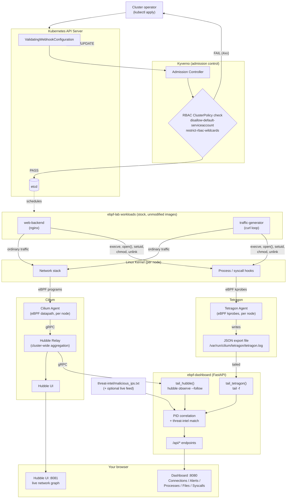

# Architecture

One diagram, the whole system: two independent paths through the same
cluster — a passive **observability** path (kernel activity flowing up to
your browser) and an active **admission-control** path (`kubectl apply`
being allowed or rejected before an object ever exists). Everything here
is covered in more depth elsewhere; this page is the map that ties it
together. See [UNDERSTANDING.md](UNDERSTANDING.md) for the observability
path in depth and [ADMISSION-CONTROL.md](ADMISSION-CONTROL.md) for the
Kyverno path in depth.

## Reading the diagram

**Left/top path — admission control (active, in-line):**
`kubectl apply` never reaches etcd directly. The API server calls out to
Kyverno's webhook first; only a `PASS` verdict lets the object through.
This is the only part of the system that can *stop* something from
happening, and it only sees the request, never runtime behavior.

**Right/bottom path — observability (passive, after the fact):**
Every other component only watches. `web-backend` and `traffic-generator`
are stock, uninstrumented images — they have no idea two separate eBPF
agents are watching every packet and every syscall they make. Cilium and
Tetragon each own a different slice of kernel activity (network vs.
process/file/syscall) and expose it through a completely different
mechanism (gRPC stream vs. a tailed JSON file) — the dashboard is the
only thing that reads both and merges them into one page.

**Where they're independent:** an admission rejection produces no
observability event (the object never existed, so eBPF never saw
anything). A workload that gets past Kyverno is then fully visible to
Cilium/Tetragon regardless of whether it complied "nicely" or just
barely — admission control judges the request shape, not runtime
behavior.

## Component reference

| Component | Role | Runs as |
|---|---|---|
| Kyverno admission controller | Evaluates ClusterPolicies against every `CREATE`/`UPDATE`, returns allow/deny | Deployment, `kyverno` namespace |
| Cilium Agent | eBPF datapath: CNI + per-packet flow visibility | DaemonSet, `kube-system` |
| Hubble Relay | Aggregates every node's local Hubble stream into one gRPC endpoint | Deployment, `kube-system` |
| Hubble UI | Visualizes the Hubble Relay stream as a live graph | Deployment, `kube-system` |
| Tetragon Agent | eBPF kprobes: process lifecycle + arbitrary kernel function hooks | DaemonSet, `kube-system` |
| ebpf-dashboard | Consumes both eBPF streams, correlates, matches threat-intel, serves one UI | Deployment, `ebpf-lab` |
| web-backend / traffic-generator | The "sample application" being observed — ordinary, unmodified workloads | Deployment, `ebpf-lab` |

## See also

- [UNDERSTANDING.md](UNDERSTANDING.md) — the observability path in depth: per-panel data sources, the threat-intel alert pipeline, PID correlation.
- [ADMISSION-CONTROL.md](ADMISSION-CONTROL.md) — the Kyverno path in depth: both policies explained, testing walkthrough, five real gotchas hit building it.
- [DEPLOYMENT.md](DEPLOYMENT.md) — stage-by-stage install commands for every component in this diagram.
