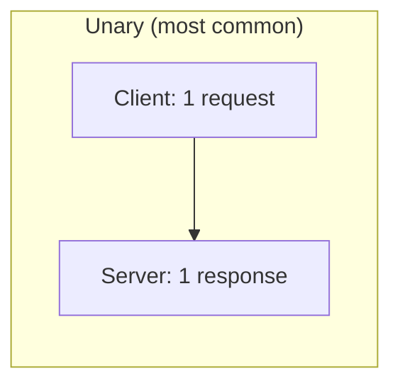
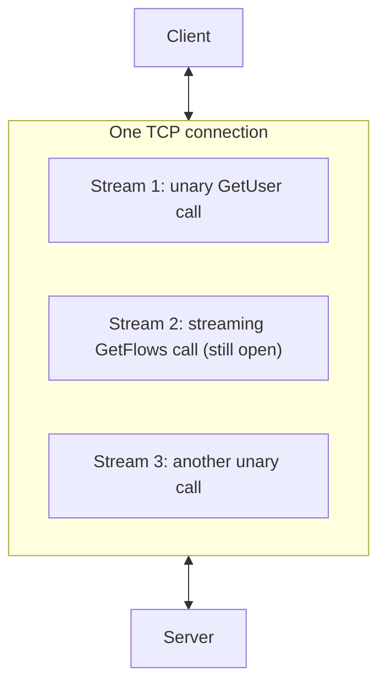

# gRPC: From First Principles to Production

A standalone reference on how gRPC actually works, beginner to advanced.
It isn't specific to this repo, but the case study at the end ties every
concept back to something you're already running here — Hubble Relay,
the one real gRPC service in this cluster.

## 1. The problem it solves

Two processes on different machines need to talk. The oldest way to do
this over HTTP is REST: the client builds a URL and a JSON body, the
server parses text, both sides just *hope* the shapes match, and every
call pays for a fresh connection or at best serial reuse.

gRPC starts from a different question: what if calling a function on
another machine felt like calling a function in your own code?

```python
response = client.GetUser(GetUserRequest(id=42))
```

That's the whole pitch: **Remote Procedure Call** — call a method, get a
typed return value, let the framework handle the network. gRPC ("gRPC
Remote Procedure Calls") is Google's implementation of this idea, and it
rests on two specific technical choices that set it apart from a generic
RPC framework:

1. **Protocol Buffers** ("protobuf") as the interface definition language and wire format — not JSON.
2. **HTTP/2** as the transport — not HTTP/1.1.

Everything else in this document follows from those two decisions.

## 2. Protocol Buffers: the contract

Before either side writes a line of networking code, you write a
`.proto` file — a schema that's the single source of truth for both
client and server.

```protobuf
syntax = "proto3";

message GetUserRequest {
  int32 id = 1;
}

message User {
  int32 id = 1;
  string name = 2;
  string email = 3;
}

service UserService {
  rpc GetUser(GetUserRequest) returns (User);
}
```

Two things happen with this file:

- **Messages** (`GetUserRequest`, `User`) compile into native structs/classes in whatever language you target — a Python class, a Go struct, a Java POJO — each with type-safe fields, not a loosely-typed dict.
- **Services** (`UserService`) compile into a client stub and a server base class. You never hand-write the networking; the generated stub *is* your API.

The numbers after each field (`= 1`, `= 2`) aren't defaults — they're the field's binary tag, permanently baked into the wire format. This is why protobuf is forwards/backwards compatible in a way ad-hoc JSON isn't: renaming a field is free, but reusing or reassigning a tag number breaks every client still holding old-numbered data.

**Why not JSON?** Protobuf messages are encoded as compact binary — no field names repeated in every message, no string parsing, no quoting. A message with a handful of integers can be a fraction of the size of the equivalent JSON, and encoding/decoding is a straight binary read, not a text scan. The cost is that protobuf messages aren't human-readable on the wire — you need the `.proto` file (or a tool like `grpcurl`/reflection, covered later) to make sense of the bytes.

## 3. Generating code

A `protoc` compiler (or the modern `buf` toolchain) reads the `.proto`
file and, via a per-language plugin, emits:

```
protoc --go_out=. --go-grpc_out=. user.proto
# or
python -m grpc_tools.protoc -I. --python_out=. --grpc_python_out=. user.proto
```

- Message classes (`GetUserRequest`, `User`) with getters/setters and binary (de)serialization built in.
- A **client stub** — the thing you actually call (`stub.GetUser(request)`).
- A **server base class/interface** you implement (`class UserServiceServicer: def GetUser(self, request, context): ...`).

Both sides generate from the *same* `.proto` file, usually vendored or
published as a shared package. That shared source of truth — not a
document someone updates by hand — is what keeps client and server from
drifting apart.

## 4. The four RPC shapes

This is the part that makes gRPC more than "RPC with a faster encoding."
Because it rides on HTTP/2 (section 7), a single logical call can carry
more than one message in either direction, over one connection, without
opening a new socket per message.



| Shape | Client sends | Server sends | Typical use |
|---|---|---|---|
| **Unary** | one message | one message | a normal function call — `GetUser(id)` |
| **Server streaming** | one message | a stream of messages | "give me updates as they happen" — a live feed, a large result set paged out |
| **Client streaming** | a stream of messages | one message | uploading many small pieces, then a final ack — e.g. a client sending metrics samples, server replies once with a summary |
| **Bidirectional streaming** | a stream | a stream, concurrently | a chat, a live negotiation, anything where both sides keep talking independently |

```protobuf
service Observer {
  // Unary: ask once, get one answer back.
  rpc GetStatus(StatusRequest) returns (StatusResponse);

  // Server streaming: ask once, keep receiving forever.
  rpc GetFlows(GetFlowsRequest) returns (stream Flow);
}
```

`GetFlows` above is deliberately shaped like Hubble's real observer
service (schematic, not the literal source) — see the case study in
section 12 for why server streaming is exactly the right shape for "tail
me every network flow as it happens."

## 5. A minimal unary call, end to end

Server (Python):

```python
class UserServiceServicer(user_pb2_grpc.UserServiceServicer):
    def GetUser(self, request, context):
        return user_pb2.User(id=request.id, name="Ada", email="ada@example.com")

server = grpc.server(futures.ThreadPoolExecutor())
user_pb2_grpc.add_UserServiceServicer_to_server(UserServiceServicer(), server)
server.add_insecure_port("[::]:50051")
server.start()
```

Client (Python):

```python
channel = grpc.insecure_channel("localhost:50051")
stub = user_pb2_grpc.UserServiceStub(channel)
response = stub.GetUser(user_pb2.GetUserRequest(id=42))
print(response.name)  # "Ada"
```

Notice what's absent: no URL building, no JSON encode/decode, no manual
socket handling. The **channel** (a persistent HTTP/2 connection,
possibly multiplexing many concurrent calls) and the **stub** (the typed
proxy object generated from the `.proto`) do all of that.

## 6. Streaming in practice

A server-streaming call looks almost identical to call, but the client
gets an iterator instead of a single value:

```python
for flow in stub.GetFlows(GetFlowsRequest(namespace="ebpf-lab")):
    print(flow.source_ip, "->", flow.destination_ip)
```

Under the hood this is a single HTTP/2 stream that the server keeps
open and keeps writing length-prefixed protobuf messages onto,
indefinitely — the client's `for` loop just keeps pulling the next one
as it arrives. There's no polling, no re-connecting per message; it's
one open pipe.

## 7. Under the hood: why HTTP/2 matters

This is the part most tutorials skip, and it's where gRPC's real
performance and design advantages come from.

**HTTP/1.1's problem**: one request per connection at a time (or a
handful via pipelining, which barely anyone implements correctly).
Concurrent calls to the same server mean either serializing them or
opening multiple TCP connections — expensive, and each one pays a fresh
TLS handshake.

**HTTP/2's fix — multiplexing**: many independent *streams* share one
TCP connection. Each gRPC call gets its own HTTP/2 stream ID; frames
from different calls interleave on the wire and get reassembled on the
other end. This is *why* four RPC shapes in section 4 are cheap to mix —
you can have a unary call and three streaming calls all in flight on the
same channel, no connection-per-call tax.



Other HTTP/2 mechanics gRPC leans on directly:

- **HPACK header compression** — gRPC uses HTTP/2 headers for metadata (auth tokens, deadlines, custom key/value pairs); HPACK means repeated headers across calls on the same connection cost almost nothing after the first one.
- **Flow control** — HTTP/2 has window-based backpressure per stream. If a client reading a `GetFlows` stream stalls, the server's writes block once the window fills, rather than the server buffering unboundedly in memory.
- **Trailers** — gRPC's status code and final error message ride in HTTP/2 *trailers* (headers sent after the body), which is precisely why gRPC needed HTTP/2 and can't run cleanly over HTTP/1.1: HTTP/1.1 doesn't have trailers usable this way.

## 8. Metadata, deadlines, and cancellation

**Metadata** is gRPC's equivalent of HTTP headers — arbitrary key/value
pairs attached to a call, separate from the typed message body. Used for
auth tokens, request IDs, tracing context.

```python
stub.GetUser(request, metadata=(("authorization", "Bearer xyz"),))
```

**Deadlines** are a first-class part of every call, not an
afterthought bolted on by the caller's HTTP client:

```python
stub.GetUser(request, timeout=2.0)  # give up after 2s
```

Crucially, a deadline **propagates**: if service A calls service B with
a 2s deadline, and B calls service C, a well-behaved gRPC stack passes
the *remaining* time budget down the chain — C doesn't get its own fresh
2 seconds. This is how you prevent a slow downstream call from silently
eating a budget the top-level caller already gave up on.

**Cancellation** works the same way in both directions — a client can
cancel an in-flight call (closing a streaming RPC early, for example),
and the server sees that as a signal to stop work immediately rather
than compute a response nobody wants.

## 9. Error handling: status codes, not exceptions-as-strings

gRPC defines a fixed set of status codes (not HTTP status codes — its
own enum), returned in the trailer mentioned above:

| Code | Meaning |
|---|---|
| `OK` | success |
| `NOT_FOUND` | the requested resource doesn't exist |
| `INVALID_ARGUMENT` | the request itself is malformed |
| `DEADLINE_EXCEEDED` | the call's deadline passed before completion |
| `UNAVAILABLE` | the server (or a proxy in between) can't be reached right now — usually safe to retry |
| `PERMISSION_DENIED` | authenticated, but not allowed to do this |
| `UNAUTHENTICATED` | no valid credentials presented |

A server signals failure by setting a status code and a message on the
call context; the client-side stub raises this as a typed exception
carrying that same code, so client code can branch on `UNAVAILABLE` vs.
`NOT_FOUND` instead of parsing a string.

## 10. Security: TLS and authentication

gRPC channels are commonly one of:

- **Insecure** (`insecure_channel` / plaintext) — fine for pod-to-pod traffic already inside a trusted, encrypted mesh (e.g. behind Cilium's own transparent encryption), never across an untrusted network.
- **TLS** — the channel itself is encrypted; the client verifies the server's certificate, same trust model as HTTPS.
- **mTLS** — both sides present certificates; common in service-mesh deployments where every workload has its own identity.

Independent of transport security, **per-call auth** rides in metadata —
a bearer token, an API key — checked by the server (often via an
*interceptor*, section 12) before the actual handler runs.

## 11. Interceptors: middleware for RPCs

An interceptor wraps every call (client-side or server-side) with
cross-cutting logic, without touching individual handler code:

```python
class LoggingInterceptor(grpc.ServerInterceptor):
    def intercept_service(self, continuation, handler_call_details):
        print("Incoming call:", handler_call_details.method)
        return continuation(handler_call_details)
```

Typical uses: structured logging, auth token verification, metrics
(latency histograms per method), distributed tracing span creation,
automatic retries on `UNAVAILABLE` with backoff.

## 12. Load balancing

Because gRPC connections are long-lived and multiplexed (section 7), the
usual round-robin-per-request load balancing that works fine for
HTTP/1.1 doesn't automatically apply — a client that opens one
connection and never reconnects will hammer a single backend pod forever
even behind a Kubernetes Service.

Two common fixes, both relevant in a Kubernetes context:

- **Client-side load balancing** — the client resolves multiple backend addresses (e.g. via DNS returning multiple A records, or a headless Service) and its gRPC library spreads new calls/connections across them itself.
- **Proxy-based** — a service mesh sidecar or an L7-aware proxy (Envoy is the canonical example, and it's the same proxy Cilium already runs for L7 visibility) terminates gRPC's HTTP/2 semantics properly and balances individual streams/requests across backends, rather than balancing raw TCP connections.

## 13. Bridging to the browser: gRPC-Web and grpc-gateway

Browsers can't open raw HTTP/2 trailer-based streams the way native gRPC
expects (no browser JS API exposes trailers or exact HTTP/2 framing
control). Two common bridges:

- **gRPC-Web** — a JS client library plus a small proxy layer that translates gRPC-Web's browser-compatible framing into real gRPC calls to the backend.
- **grpc-gateway** — generates a REST/JSON HTTP server that internally calls your gRPC service, so anything that only speaks plain JSON-over-HTTP (curl, a legacy client, a webhook target) gets a normal-looking REST API in front of the same `.proto`-defined service.

## 14. Observability and discoverability

- **Server Reflection** — an optional gRPC service a server can expose that lets a generic client (like `grpcurl`) ask "what services and methods do you have?" *without* the `.proto` file in hand — the same idea as `curl`-ing a REST API's OpenAPI spec.
- **Health Checking Protocol** — a standard `grpc.health.v1.Health` service most gRPC servers implement, so load balancers and orchestrators (Kubernetes readiness probes, service meshes) can ask "are you healthy?" in a protocol-native way instead of guessing from TCP connectivity alone.
- **Distributed tracing** — interceptors (section 11) typically create a trace span per call and propagate trace context via metadata, so a single user request that fans out across a dozen gRPC calls can be reconstructed as one trace in a tool like Jaeger or Tempo.

## 15. Case study: the one real gRPC service in this repo

Hubble Relay (deployed by this lab, see
[ARCHITECTURE.md](ARCHITECTURE.md) and
[UNDERSTANDING.md](UNDERSTANDING.md)) is a gRPC server exposing an
`Observer`-style service — schematically:

```protobuf
service Observer {
  rpc GetFlows(GetFlowsRequest) returns (stream Flow);
}
```

This is a **server-streaming** RPC (section 4), and it's the correct
shape for exactly one reason: Hubble Relay doesn't know in advance how
many network flows there will be, or when the next one happens — a
unary "give me all flows" call would have to either wait forever or
arbitrarily cut off. Server streaming lets it push each `Flow` message
the instant Cilium's eBPF datapath reports it, over one long-lived
HTTP/2 stream, for as long as the client keeps listening.

**Two independent clients call this same RPC:**

- **Hubble UI** calls it (via a small backend proxy) to drive its live
  graph — every new `Flow` message becomes a new edge/animation.
- **`ebpf-dashboard`** calls it too, but indirectly: rather than
  embedding a generated gRPC stub, it shells out to the `hubble`
  CLI (`hubble observe --server hubble-relay.kube-system.svc.cluster.local:80 --follow -o json`),
  which is itself a gRPC client written in Go — it makes the same
  `GetFlows` call, and the dashboard just reads the CLI's stdout as
  newline-delimited JSON instead of linking the gRPC library directly.
  This is a perfectly normal pattern: you don't have to hand-roll a
  gRPC client in every language if a well-behaved CLI already speaks the
  protocol for you.

That single open stream, sitting there for as long as `hubble observe
--follow` runs, is section 6's streaming example made concrete: no
polling, no reconnect-per-flow, just one pipe that both `ebpf-dashboard`
and Hubble UI keep pulling messages off of, independently, for as long
as the cluster is up.

## 16. Glossary

| Term | Meaning |
|---|---|
| **Protocol Buffers (protobuf)** | The binary serialization format and interface-definition language gRPC uses to define messages and services. |
| **`.proto` file** | The schema source of truth; compiled into client/server code for every target language. |
| **Stub** | The generated client-side object you call methods on — looks like a local object, actually makes network calls. |
| **Channel** | A persistent connection (usually HTTP/2) a client uses to reach a server; can carry many concurrent calls. |
| **Unary / streaming RPC** | The four call shapes — see section 4. |
| **Metadata** | Key/value pairs attached to a call, gRPC's analog of HTTP headers. |
| **Deadline** | A time budget attached to a call, propagated down a call chain. |
| **Interceptor** | Middleware wrapping every call on the client or server side — logging, auth, retries, tracing. |
| **Server Reflection** | An optional service letting generic tools discover a server's API without the `.proto` file. |
| **gRPC-Web / grpc-gateway** | Bridges letting browsers or plain REST/JSON clients talk to a gRPC service. |

## 17. Further reading

- [grpc.io/docs](https://grpc.io/docs/) — the official documentation and language-specific quickstarts.
- [Protocol Buffers language guide](https://protobuf.dev/programming-guides/proto3/) — the full `.proto` syntax reference.
- [RFC 7540](https://www.rfc-editor.org/rfc/rfc7540) — the HTTP/2 specification gRPC is built on.
- [Cilium's Hubble documentation](https://docs.cilium.io/en/stable/observability/hubble/) — the real system behind section 15.

## See also

- [ARCHITECTURE.md](ARCHITECTURE.md) — where Hubble Relay's gRPC service sits in this lab's overall system.
- [UNDERSTANDING.md](UNDERSTANDING.md) — how `ebpf-dashboard`'s `tail_hubble()` thread consumes that stream in practice.
