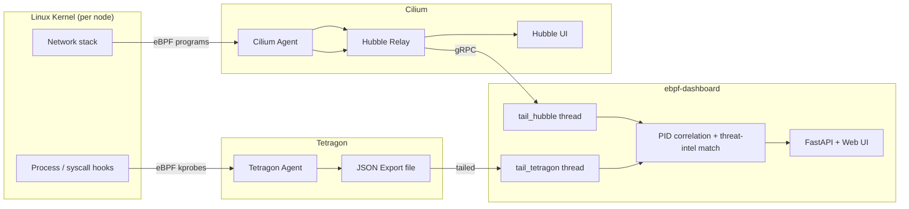

# Understanding the Lab

What's actually happening under the hood, end to end — from a syscall in
the kernel to a row lighting up in your browser.

## eBPF, in one paragraph

eBPF lets you attach small, sandboxed programs to specific points in the
Linux kernel — a function being called (`kprobe`), a syscall being entered,
a network packet crossing an interface — and have the kernel run that
program *every time it happens*, in-line, with no involvement from the
process being observed. Nothing is injected into the application, nothing
is relinked, no sidecar proxies traffic. The application doesn't know it's
being watched. That's the property this whole lab demonstrates: `nginx` and
`curl` in this cluster are stock, unmodified images.

## Who does what



Two independent eBPF-based agents run as DaemonSets on every node, each
watching a different slice of kernel activity:

| | Cilium / Hubble | Tetragon |
|---|---|---|
| **Watches** | Network packets crossing the datapath | Process lifecycle + arbitrary kernel functions (kprobes) |
| **Feeds** | Network Connections panel | Process Creation, File Access, System Calls panels |
| **Exposed via** | gRPC (Hubble Relay) | A JSON-lines file on the node (`/var/run/cilium/tetragon/tetragon.log`) |
| **Consumed by dashboard via** | the `hubble` CLI, piped and parsed live | tailing the file like `tail -f` |

The dashboard doesn't replace either tool — it's a thin layer that
consumes both streams, cross-references them, and renders one page instead
of two.

## The threat-intel alert pipeline

This is the part that maps directly onto the diagram you described:

```
Pod -> Outbound Connection -> Linux Kernel -> eBPF Program -> Security
Monitoring Tool -> Threat Intelligence Feed -> Is IP Malicious? -> Alert / Ignore
```

Concretely, in `dashboard/app.py`:

1. `traffic-generator` (or any pod) opens a TCP connection.
2. Cilium's eBPF datapath programs see the packet and record a **flow**
   (`Pod -> Outbound Connection -> Linux Kernel -> eBPF Program`).
3. Hubble Relay streams that flow out over gRPC; the dashboard's
   `tail_hubble()` thread receives it via a running `hubble observe --follow`
   subprocess (`Security Monitoring Tool`).
4. `handle_hubble_line()` pulls out the destination IP and checks it
   against `malicious_ips` — an in-memory set refreshed every 60s from
   [`threat-intel/malicious_ips.txt`](../threat-intel/malicious_ips.txt),
   and optionally merged with a live feed if `THREAT_FEED_URL` is set
   (`Threat Intelligence Feed` / `Is IP Malicious?`).
5. Match → the flow record is duplicated into the `alerts` deque with a
   `reason` field, and rendered red (`Generate Alert`). No match → it only
   appears in the normal Connections panel (`Ignore`).

The demo list ships with a handful of **RFC 5737 documentation IPs**
(`192.0.2.0/24`, `198.51.100.0/24`, `203.0.113.0/24`) — reserved by IANA for
examples and never routed on the real internet. That's deliberate: the
traffic-generator "attacks" them on a timer so the pipeline fires
deterministically without internet access and without ever labeling a real
host malicious.

## The one non-obvious engineering problem: attributing kprobe events to pods

This is worth understanding if you're going to trust the File Access /
System Calls panels, and it's covered in more depth (with the exact
debugging trail) in [DEPLOYMENT.md](DEPLOYMENT.md#stage-3--tetragon-process--file--syscall-visibility).

Short version: Tetragon's `process_exec` events arrive fully enriched with
pod/namespace/container info. Its `process_kprobe` events (file opens,
syscalls) — in this nested-Docker-on-Windows environment — arrive with
**no pod info at all**, just a bare PID. To attribute a file-open or
syscall event to the right pod, the dashboard:

1. Caches every `process_exec` event by PID → `{pod, namespace, binary}`
   (`remember_pid`).
2. When a `process_kprobe` event with no pod info arrives, it looks up its
   PID in that cache.
3. If the PID isn't cached *yet* — because Tetragon's own exec-enrichment
   pipeline can lag several seconds behind the raw kprobe event — the
   event is parked in a retry queue (`pending_kprobes`) and re-checked
   every 500ms for up to 45 seconds, rather than being dropped on the
   first miss.
4. If it still can't be attributed after that window, it's genuinely
   unattributable (host/control-plane noise, not one of the monitored
   pods) and is dropped — this is *why* the panels stay focused on your
   workloads instead of flooding with `kube-proxy`/`containerd` activity.

## Panel-by-panel guide

| Panel | Source | What each row means |
|---|---|---|
| **Threat Intel Alerts** | Hubble flow + threat-intel match | An outbound connection whose destination IP matched the threat list. |
| **Network Connections** | Hubble flow (`hubble observe`) | Any L3/L4 flow Cilium's datapath saw — pod-to-pod or pod-to-external, with direction (`EGRESS`/`INGRESS`) and Cilium's policy verdict. |
| **Process Creation** | Tetragon `process_exec` / `process_exit` | A new process started (or exited) inside a monitored pod, with the full command line. |
| **File Access** | Tetragon `process_kprobe` on `fd_install` | A process opened a file matching the watched path prefixes (`/etc`, `/tmp`, `/root`, `/home`, `/app`, `/data`, `/var/run/secrets`, ...) — see [`k8s/tetragon-policies/file-monitoring.yaml`](../k8s/tetragon-policies/file-monitoring.yaml). |
| **System Calls** | Tetragon `process_kprobe` on `setuid`/`chmod`/`unlink`/`unlinkat` | A process changed its UID, changed file permissions, or deleted a file — see [`k8s/tetragon-policies/syscall-monitoring.yaml`](../k8s/tetragon-policies/syscall-monitoring.yaml). (`connect()` was deliberately left out here — Hubble already covers network connections more reliably; see the note in that file.) |

## Admission control: a different point in the pipeline

Everything above is **passive observation** — eBPF watches what already
happened, after the fact. This lab also has an **active** control:
[Kyverno](https://kyverno.io), an admission controller that sits in-line in
front of the Kubernetes API server and can *reject* a request before the
object is ever created — `kubectl apply -> API Server -> Kyverno -> RBAC
Policy Check -> PASS/FAIL`. It enforces two RBAC-hygiene policies
cluster-wide (no default ServiceAccounts, no wildcard Roles/ClusterRoles).

That's a big enough topic to warrant its own page:
**[ADMISSION-CONTROL.md](ADMISSION-CONTROL.md)** — architecture, both
policies explained, a testing walkthrough with expected output, and four
real Kyverno gotchas hit while building it (an operator bug that silently
rejected *everything*, autogenerated rules blocking `DELETE`, the policy
engine blocking its own bootstrap, and a `background`-mode incompatibility).

## Testing / verification

The fastest way to build confidence that this is live, not a static mock:
trigger a distinctive event yourself and watch it appear.

```bash
scripts/port-forward.sh   # keep running in its own terminal
```

Then, in another terminal:

**Process creation** — run something distinctive and look for it in the
**Process Creation** panel:
```bash
kubectl exec -n ebpf-lab deploy/web-backend -- whoami
```

**File access** — look for `/etc/os-release` in **File Access**:
```bash
kubectl exec -n ebpf-lab deploy/web-backend -- cat /etc/os-release
```

**System calls** — look for `__x64_sys_chmod` in **System Calls**:
```bash
kubectl exec -n ebpf-lab deploy/web-backend -- sh -c "touch /tmp/test.txt && chmod 600 /tmp/test.txt"
```

**Network connection** — a new `EGRESS` row in **Network Connections**:
```bash
kubectl exec -n ebpf-lab deploy/web-backend -- wget -qO- --timeout=2 http://web-backend.ebpf-lab.svc.cluster.local || true
```

**Threat-intel alert** — a red row in **Alerts** within ~5s:
```bash
kubectl exec -n ebpf-lab deploy/web-backend -- wget -qO- --timeout=2 http://192.0.2.10 || true
```

**Prove the dashboard isn't the source of truth** — watch the raw agent
streams directly and trigger an event in a second terminal while they run:
```bash
# Tetragon, raw
kubectl -n kube-system exec ds/tetragon -c tetragon -- timeout 6 tetra getevents -o compact

# Hubble, raw, scoped to the lab namespace
kubectl exec -n kube-system ds/cilium -- hubble observe \
  --server hubble-relay.kube-system.svc.cluster.local:80 \
  --namespace ebpf-lab --follow
```

**Sanity-check via the API directly** (numbers should climb between two
calls a few seconds apart — proof it's a live tail, not a snapshot):
```bash
curl -s http://127.0.0.1:8080/api/stats
```

If a panel doesn't update after its trigger, check the matching stage in
[DEPLOYMENT.md](DEPLOYMENT.md) — every panel's data source, and its known
failure modes, are documented there.

## Glossary

| Term | Meaning here |
|---|---|
| **kprobe** | An eBPF program attached to (almost) any kernel function, firing every time that function is called. |
| **TracingPolicy** | A Tetragon custom resource declaring which kernel functions/syscalls to hook and how to filter/report on them. |
| **exec_id** | Tetragon's unique ID for one process's lifetime, used internally to correlate its exec/exit/kprobe events. |
| **verdict** (Hubble) | Cilium's policy decision on a flow — `FORWARDED`, `DROPPED`, etc. |
| **traffic_direction** (Hubble) | `EGRESS` (leaving the pod) or `INGRESS` (arriving at the pod), from that pod's perspective. |
| **process_kprobe** | A Tetragon event type: "a watched kernel function was called by this process." Backs both the File Access and System Calls panels here, distinguished by which function fired. |

Kyverno/admission-control terms (`ClusterPolicy`, `Autogen`, `Subject`,
...) are in [ADMISSION-CONTROL.md](ADMISSION-CONTROL.md#glossary).
